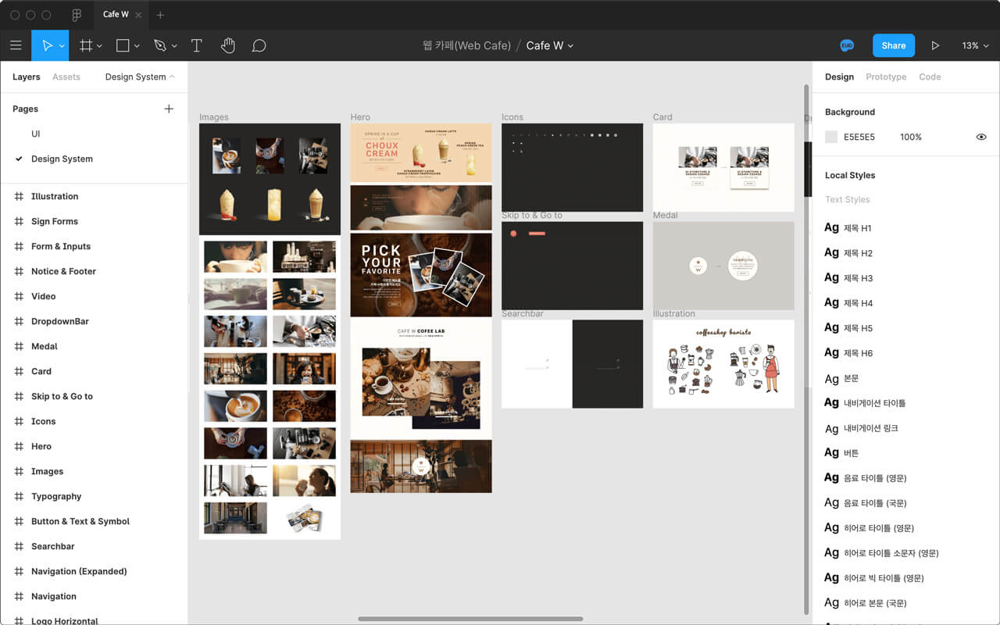

# Cafe W 리뉴얼 프로젝트

[웹 카페(Web Cafe)](http://seulbinim.github.io/exRWD) 학습 자료 리뉴얼 진행 중.

리뉴얼 | 수행
-- | --
UI 디자인 (디자인 시스템) | 야무 ([yamoo9](https://facebook.com/yamoo9))
UI 개발 (마크업 / 스타일링) | 김데레사 ([seulbinim](https://www.facebook.com/seulbinim))

 

## 디자인 워크플로우

[Figma](https://figma.com) 도구를 사용해 디자인 시스템 및 UI 디자인, 프로토타이핑 구현.

### 1. 디자인 시스템

UI 디자인에 활용 될 컴포넌트 및 시스템(체계) 제작.

### 2. UI 디자인

디자인 시스템을 기반으로 UI 디자인 블록 제작.

.jpg)

